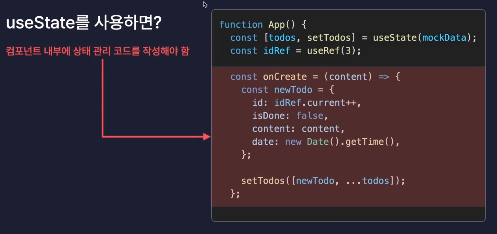

# useReduce란?

<div style="display: flex; justify-content: space-around;">
  
  
</div>

- 컴포넌트 내부에 새로운 State를 생성하는 React Hook
- 모든 useState는 useReducer로 대체 가능
  - 상태 관리 코드를 외부로 분리 할 수 있다..!

# useMemo란?

<div style="display: flex; justify-content: space-around;">
  
  
</div>

- '메모이제이션'기법을 기반으로 불필요한 연산을 최적화 하는 리액트 훅
  (Memoization: 기억해두기, 메모해두기)
- 동일한 연산을 반복적으로 수행해야 될 떄, 연산 낭비를 줄이기 위해 최초로 한번 계산했을 때의 결과 값을 메모리 어딘가에 보관해 둔 후, 다시 이 연산이 필요해지면 저장되어있던 결과 값을 사용
- 불필요한 연산이 줄어 프로그래밍 성능 Good !
- props가 바뀌었을 때만 컴포넌트를 리렌더링 하도록 최적화

```
jsx
  const getAnalyzedData = () => {
    console.log("getAnalyzedData 호출!");

    const totalCount = todos.length;
    const doneCount = todos.filter((todo) => todo.isDone).length;

    const notDoneCount = totalCount - doneCount;

    return {
      totalCount,
      doneCount,
      notDoneCount,
    };
  };
```

## 불필요한 리렌더 제거하기

1. Header는 리렌더 될 필요가 없다.
2. memo는 얕은 비교를 한다. (객체 타입은 무조건 서로 모두 다른 값이라고 생각한다.)
   ➡️ 따라서 TodoItem의 `export default memo(TodoItem)`을 하더라도 `onDelete` `onUpdate` 의 객체 타입에 의해 매번 새롭게 전달 될때마다 다른 값을 전달하므로 props가 바뀌었다라고 생각한다.

### 🤔 2의 해결 방법 (고차 컴포넌트 HOC)

```jsx
// 메모 함수 안 두번째 인수로 콜백함수를 넣어 최적화 기능을 customize한다.
export default memo(TodoItem, (prevProps, nextProps) => {
  // 반환 값에 따라, Props가 바뀌었는지 안바뀌었는지 판단
  // T -> Props 바뀌지 않음 -> 리렌더링 X
  // F -> Props 바뀜 -> 리렌더링 O
});
```

- 즉, 객체 타입을 제외하고 `id`, `isDone`, `content`, `date`가 바뀌었을 경우 리렌더링을 시켜준다!
  (최종)

```jsx
export default memo(TodoItem, (prevProps, nextProps) => {
  if (prevProps.id !== nextProps.id) return false;
  if (prevProps.isDone !== nextProps.isDone) return false;
  if (prevProps.date !== nextProps.date) return false;

  return true;
});
```

- 참고자료 : [HOC 패턴](https://patterns-dev-kr.github.io/design-patterns/hoc-pattern/)

## `useCallback()` 객체 최적화

```jsx
// 첫번째 인수 : memoization 하고 싶은 함수
const func = useCallback(() => {}, []); // 첫 렌더링(마운트 시)에만 딱 한번 함수 생성
```

- 꼭 최적화가 필요한 함수 , 컴포넌트 , 연산들에만 적용하는게 Good!
- 참고자료 : [언제 최적화를 쓸까?](https://goongoguma.github.io/2021/04/26/When-to-useMemo-and-useCallback/)
